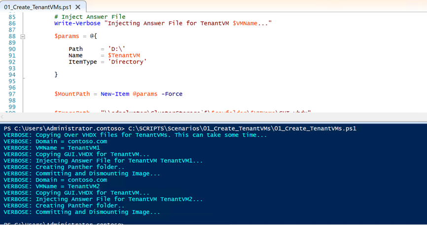
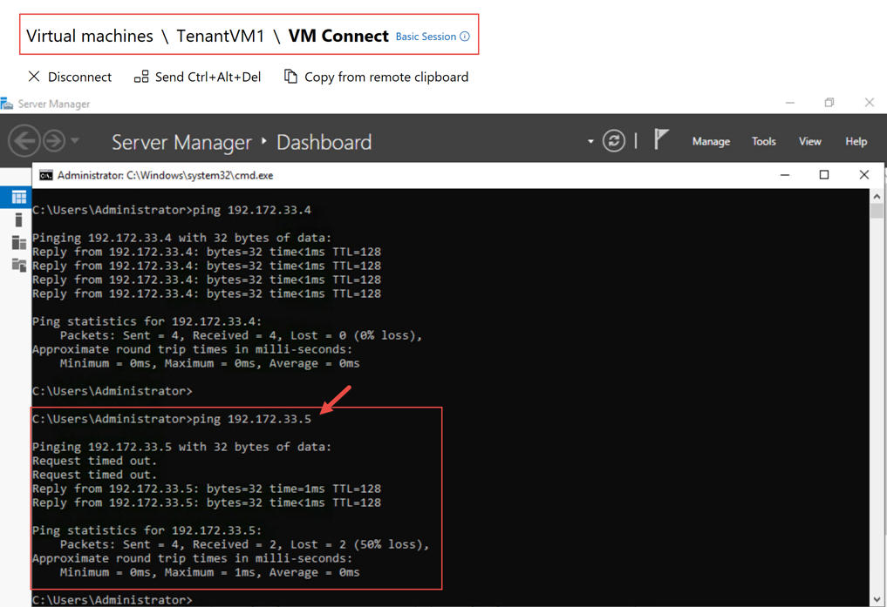
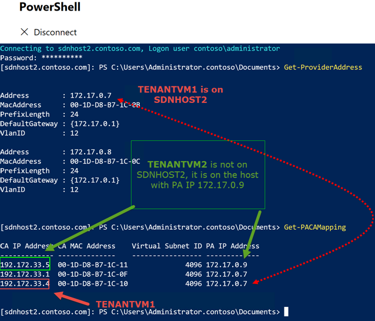

# Lab 01 : Create Tenant VMs and attach to SDN VM Network

## Objective

In this scenario, you have been asked to create two Windows Server Datacenter tenant VMs in a SDN VM Network. These tenant VMs will only be able to talk with one another.

You come up with the following action plan:

1. Create a SDN VM Network named **TenantNetwork1** in Windows Admin Center with a Address Prefix of **192.172.0.0/16**

2. Carve out a subnet named **TenantSubnet1** from the **TenantNetwork1** Address Prefix that you just created. This subnet will be: **192.172.33.0/24**

3. Create the VHDX files for VMs **TenantVM1** and **TenantVM2** on the Cluster Storage in the S2D cluster: **SDNCluster**

4. In Windows Admin Center, create **TenantVM1** and **TenantVM2** virtual machines and then connect their network adapters to **TenantSubnet1**

5. Run Ping tests to validate VXLAN communication between both VMs.

6. Examine Provider Address mappings.

7. Test NIC encapsulation overhead settings.

## Exercise 01:   Create a SDN VM Network named **TenantNetwork1** in Windows Admin Center with a Address Prefix of **192.172.0.0/16**

1. Log into **Console** using RDP

2. Open the link to Windows Admin Center on the desktop

3. In **Windows Admin Center**, add a **Hyper-Converged Cluster Connection** to SDNCluster and your network controller if you haven't already done so.

4. Navigate to **Windows Admin Center -> sdncluster -> Virtual Networks**. In **Virtual Networks**, select **Inventory**.

5. In **Inventory** select **+ New**

6. In the Virtual Network dialog, fill in the following and then click **Submit**:

|   |   |
|---|---|
| Virtual Network Name:  |  **TenantNetwork1**  |
| Address Prefixes:  | add  **192.172.0.0/16**  |
| Subnet Name: | add **TenantSubnet1**   |
| Subnet Address Prefix: | add **192.172.33.0/24**  |

7. Wait about a minute and then you should see the following in your Virtual Networks inventory:

8. Step 01 is now complete.

## Exercise 02: Create the TenantVM's virtual hard disks*

1. In the **Console** VM, open a **PowerShell** console with Admin rights.

2. In the PowerShell console, navigate to ``C:\SCRIPTS\LABS\01_Create_TenantVMs\``

3. Run ``.\01_Create_TenantVMs.ps1``

4. Wait for the script to successfully complete

> This script copies the GUI.VHDX to folders on the C:\ClusterStorage\<volume>\ drive, injects answer files that specify the VM's Name, Product Key, and also disables Windows Firewall so you can easily perform a ping test.

## Exercise 03: Create **TenantVM1** and **TenantVM2** virtual machines and then connect their network adapters to **TenantSubnet1**

1. Go to **Windows Admin Center**

2. Navigate to **Windows Admin Center -> sdncluster -> Virtual Machines**. In **Virtual Machines**, select **Inventory**.

3. In **Inventory** select **+ New**

4. Fill in the **New Virtual Machine Dialog with the following and then click **Create**:

 | Setting   | Value  |
|---|---|
| Name:  |  **TenantVM1** |
| Generation:  | **Generation 2**  |
| Host:    | **SDNHOST2**    |
| Path:   | *Leave Default*     |
| Virtual Processor Count:   |  **2**  |
| Memory:   | **2GB**   |
| Use dynamic memory:   |  *selected*  |
| Network adapter:   | **sdnSwitch**  |
| Virtual Network:   | **TenantNetwork1**   |
| Virtual Subnet:  |  **TenantSubnet1 (192.172.33.0/24)**  |
| IP Address:   |  **192.172.33.4**  |
| Storage:   | *select* **Add disk**   |
| Use an existing virtual hard disk:   | *Select* **Use and existing virtual hard disk** |
| Path:   | **C:\ClusterStorage\S2D_vDISK1\TenantVM1\GUI.vhdx**   |

>

5. Repeat the last step, except enter the values for **TenantVM2**:

 | Setting   | Value  |
|---|---|
| Name:  |  **TenantVM2** |
| Generation:  | **Generation 2**  |
| Host:    | **SDNHOST3**    |
| Path:   | *Leave Default*     |
| Virtual Processor Count:   |  **2**  |
| Memory:   | **2GB**   |
| Use dynamic memory:   |  *selected*  |
| Network adapter:   | **sdnSwitch**  |
| Virtual Network:   | **TenantNetwork1**   |
| Virtual Subnet:  |  **TenantSubnet1 (192.172.33.0/24)**  |
| IP Address:   |  **192.172.33.5**  |
| Storage:   | *select* **Add disk**   |
| Use an existing virtual hard disk:   | *Select* **Use and existing virtual hard disk** |
| Path:   | **C:\ClusterStorage\S2D_vDISK1\TenantVM2\GUI.vhdx**   |

6. After both VMs have been created, start both of them and then continute onto the next step.

## Exercise 04: Run Ping tests to validate VXLAN communication between both VMs.

1. Using Windows Admin Center's **VM Connect** or **Hyper-V Manager**  log into **TenantVM1 (192.172.33.4)**

2. From a **CMD** Prompt or a Windows PowerShell prompt, Try pinging **192.172.33.5**.

3. If you are successful, then you have successfully created a TenantVM Network and have two Hyper-V virtual machines communicating over that network.

## Exercise 05: Understand Provider Addresses

In this exercise, we will look at the host SDNHOST2 and examine its provider addresses. Provider Addresses are used to route traffic between Hyper-V Hosts. For instance, in the last exercise, you pinged **192.172.33.5 (TenantVM1)** from **192.172.33.4 (TenantVM2)**. Since the 192.172.33.0/24 network is totally isolated at this time and both VMs are on different hosts, how are we routing traffic between the two VMs?  Let's look at how this works.

1. Using Windows Admin Center, go to SDNHOST2 and then select PowerShell and login.

2. Type in the PowerShell command **Get-ProviderAddress** and then press **Enter** 

3. The Provider Addresses for this host appears. Note the addresses.

4. Next, run **Get-PACAMapping** to get a list the mapping of PA Addresses to hosts.

5. In the screenshot above, we can see that TenantVM1 **192.172.33.5 (TenantVM1)** is on this host as its PA is 172.17.0.7. When **Get-ProviderAddress** was run, we could see that 172.17.0.7 belongs to SDNHOST2. However, for **192.172.33.4 (TenantVM2)**, the PA is (172.17.0.9) which is **NOT** local. So if TenantVM1 tries to send traffic to TenantVM2, SDNHOST2's VM Switch is going send the traffic over the PA address 172.17.0.9 (Which, this example is SDNHOST3)

## Exercise 06: Testing Hyper-V Host Encapsulation Settings

A common problem in the PA logical network is that the physical network ports and/or Ethernet card do not have a large enough MTU (Jumbo Frames) configured to handle the overhead from VXLAN (or NVGRE) encapsulation. This can cause issues where tenant VMs cannot communicate with one another. In order to verify that this is not an issue, you can run the **Test-EncapOverheadSettings** PowerShell cmdlet on all hosts in order to verify that all physical NICs can handle encapsulated packets.

1. Using Windows Admin Center, go to SDNHOST2 and then select PowerShell and login.

2. Run **Test-EncapOverheadSettings** and examine the results.

