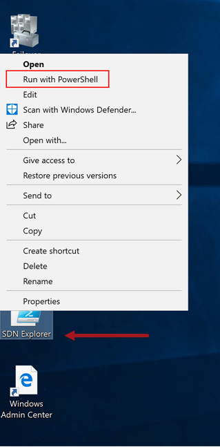
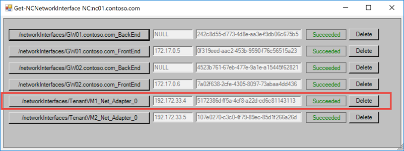
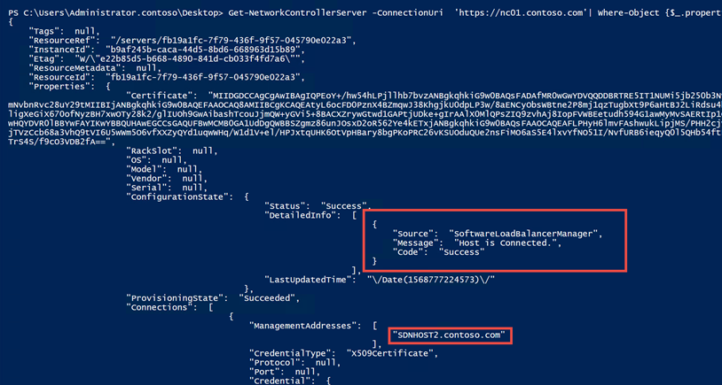
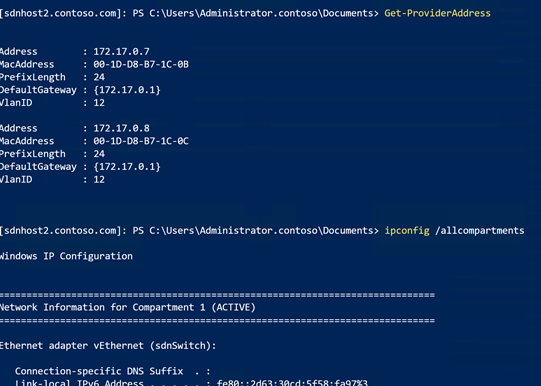
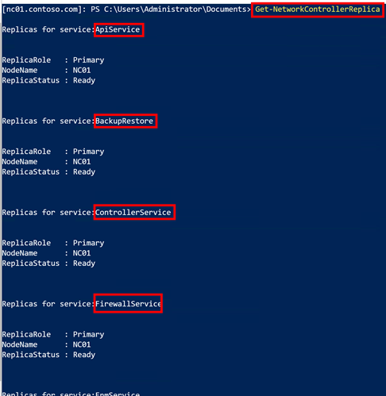
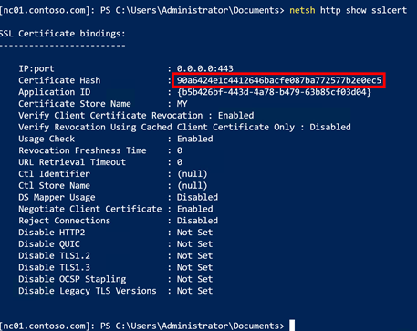

# Lab 02 : Network Controller Architecture

## Objective

In this scenario, we will be examining the SDN architecture and the different ways to access information from Network Controller.

## Exercise 01: Use SDN Explorer to examine Network Controller Configuration

SDN Explorer allows you to view the internal configuration of Network Controller. This tool is available at the Microsoft SDN [GitHub](https://github.com/microsoft/SDN/tree/master/SDNExpress/Tools/SDNExplorer) page. In this exercise, we will examine this extremely useful tool and also show how configuration settings in Network Controller link to each other through references.

1. Log into **Console** using RDP
2. On the desktop, **Right-Click** on the **SDN Explorer** shortcut and select **Run with PowerShell**

 

3. SDN Explorer will now appear.

 

4. In SDN Explorer, click on **Network Interfaces**

5. Click on the **TenantVM1** Network Adapter 

 

6. In the output, take note of the subnet reference. In this example, the reference is *"/virtualNetworks/TenantNetwork1/subnets/TenantSubnet1"*

 

7. Go back to the SDN Explorer main menu and select **VirtualNetworks**, then select **TenantNetwork1**. Look at the *IPConfigurations* section and see the references to the both TenantVM1 and TenantVM2 Network Interfaces.

 

In conclusion, SDN Explorer is a extremely useful tool to dynamically view Network Controller configuration information. However, it is not recommended that SDN Explorer be used for actual Network Controller configuration. For changing Network Controller configuration, it is recommended to use either the Network Controller PowerShell cmdlets or the Network Controller REST API.

## Exercise 02: Use Rest API to retrieve Network Controller Configuration

In this exercise you will collect the Server Information using Network Controller's REST API and get the same information if you had selected Servers in SDN Explorer. The purpose of this exercise is to show you that there a multiple ways of getting the same information.

1. Log into **Console** using RDP
2. From the Desktop, open PowerShell ISE

 

3. In the PowerShell ISE, enter and then execute the following command:

**Invoke-RestMethod -Uri 'https://nc01.contoso.com/networking/v1/servers' | ConvertTo-Json -Depth 100**

 Your output should look exactly the same as if you clicked on the **Servers** button in SDN Explorer. Using Invoke-RestMethod is just another way of communicating with Network Controller. The main takeway from this exercise is that you can use any operating system, or even a internet browser to query or configure Network Controller through its REST API.

## Exercise 03: Use PowerShell to retrieve Network Controller Configuration

In this exercise, we are going to get the same information that we received in the last exercise, but this time we will be using a PowerShell cmdlet to get this information.

1. Log into **Console** using RDP
2. From the Desktop, open PowerShell ISE

 

3. In the PowerShell ISE, enter and then execute the following command:

**Get-NetworkControllerServer -ConnectionUri  'https://nc01.contoso.com' | ConvertTo-Json -Depth 100**

4. To get select only one server based on name, you can run the following command:

**Get-NetworkControllerServer -ConnectionUri  'https://nc01.contoso.com'| Where-Object {$_.properties.connections.managementaddresses -match 'SDNHOST2'} | ConvertTo-Json -Depth 100**

5. Notice that in the output, we can see that the host is connected to the SLB Manager. This means that Network Controller is connected to the Hyper-V Host via the NCHOSTAgent and also the In the next exercise, we will be looking at how Network Contoller connects to the host.

 

It should be noted that using **ConvertTo-JSON** is not required and is not to be used if you wish to treat the output from this cmdlet as an object. In the last few exercises, you've seen all the methods that you can interface with Network Controller. The other options that you have to administer and configure SDN are System Center Virtual Machine Manager (SCVMM) (*which requires SCVMM install Network Controller*) and Windows Admin Center.

## Exercise 04: Examine SDNHOST2's connection to Network Controller

In this exercise, we are going to look at how we can verify that Network Controller controller is connected to the Hyper-V Host SDNHOST2. The following graphic describes how Network Controller communicates with Hyper-V Hosts to push down policies:

 

1. Using Windows Admin Center, go to SDNHOST2 and then select PowerShell and login.

 

2. In SDNHOST2's PowerShell, let's see if the host is connected to network controller by running the following three commands:

    **Get-Service NCHostAgent**

    **Get-Service SlbHostAgent**

    **Get-NetTCPConnection -LocalPort 6640**

    
 

From the results, you can see that the NCHostAgent and SlbHostAgent are running AND we have multiple connections to TCP port 6640. These results should be the same across all nodes. If not, then there is an issue preventing communication with the Network Controller from the Hyper-V Host.

## Exercise 05: Examine SDNHOST2's Provider Addresses

1. On SDNHost2, run the following PowerShell command:

**Get-ProviderAddress**

 

These HNV Provider IP Addresses (PA IPs) are assigned to Ethernet Adapters created in a separate TCPIP network compartment and have an adapter name of VLANX where X is the VLAN assigned to the HNV Provider (transport) logical network. You can find the compartment by running the following command:

**ipconfig /allcompartments**

 

## Exercise 06: Examine SDNHOST2's Network Controller Certificate location

In the default SDNEXPRESS configuration, Network Controller communicates with Hosts and SLB VMs using certificates. On a host you can view the Network Controller certificate in its certificate store.

 1. In SDNHOST2's PowerShell, you will be able to find the NC certificate by running the following PowerShell command:

 **Get-ChildItem -Path Cert:\LocalMachine\Root**

 

## Exercise 07: Examine Network Controller's Setup

In this exercise, you will be logging into NC01.CONTOSO.COM (the single-node NC implementation) and examining the Network Controller setup:

1. Using Windows Admin Center, go to SDNHOST2 and then select PowerShell and login.

 

2. In PowerShell, type the following command to see the all of the micro-services that make up Network Controller, the node their running on (since we have only one node, then you are going only see NC01), and their status:

**Get-NetworkControllerReplica**

 

3. Next, run **Get-NetworkController** and examine the certificate thumbprint. Note that this thumbprint will match the thumbprint found in Exercise 6. 

 

4. Next, let's look at the certificate attached to port 443 (SSL) on network controller. This is the port that you authenticate with when running REST API calls as well as internal communications for SDN.  Run the following command in PowerShell:

**netsh http show sslcert**

 

# End of Lab

