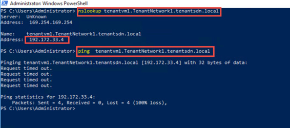
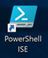
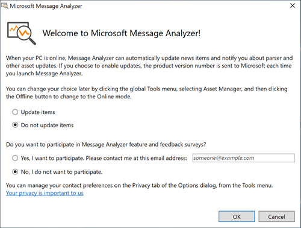
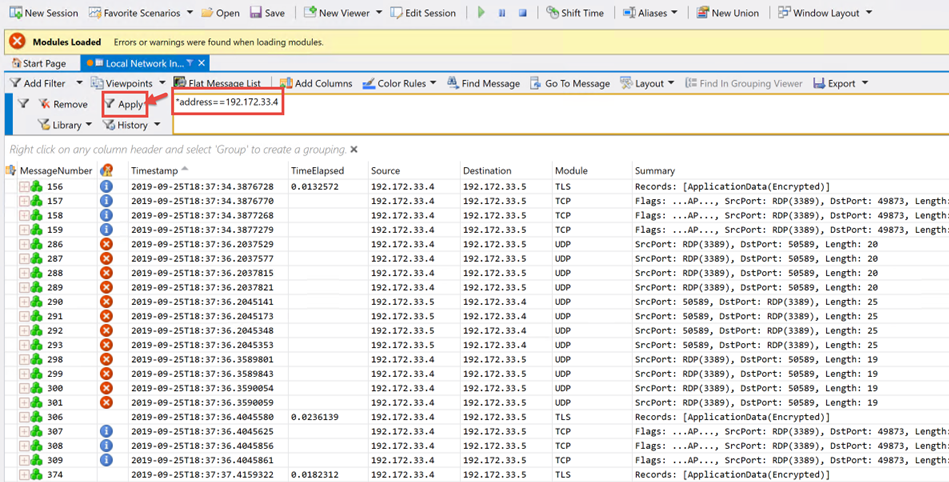
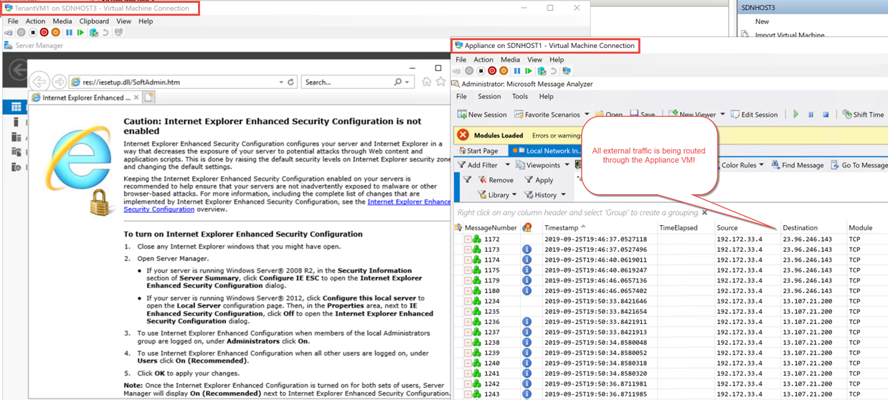

# Lab 04 : Virtual Network Peering, User Defined Routes, and Port Mirroring

## Objective

In this series of exercises, you will learn to configure Virtual Network Peering and User Defined Routes.

# Lab 4.01 Peering Virtual Networks

In this lab you will be peering two Virtual Networks with one another. The requirements for this lab are that the following scripts have already been executed from previous labs and the virtual machines that these labs create still exist:

>a. **01_Create_TenantVMs.ps1** (with additional configuration) ***or*** **01_Create_TenantVMs_Complete.ps1** 

>b. **03.01_Create_WebServerVMs.ps1**

>c. **03.03_Deploy_iDNS.ps1**

> Also note that Peering will only work on Server 1803 or higher.


## Exercise 01: Assess Current Peering Situation

1. In **Hyper-V Manager** or **Windows Admin Center**, connect to and logon to the virtual machine **WebServerVM1**.

2. In **WebServerVM1**, open a **CMD** or **PowerShell** console and type the following commands:

```nslookup TenantVM1.TenantNetwork1.tenantsdn.local```

```ping TenantVM1.TenantNetwork1.tenantsdn.local```

You should be able to resolve the IP for **TenantVM1** but **not** be able to successfully ping it:



>You cannot ping as the tenant VMs are on different VM Networks. You can perform a lookup of the IP as the tenants all share the same DNS server.


## Exercise 02: Peer the VM Networks **TenantNetwork1** with **webNetwork1**

1. From the desktop on the console VM, load the PowerShell ISE with Admin Rights.

 

2. In the PowerShell ISE, navigate to ``C:\SCRIPTS\LABS\04_Peering_and_User_Defined_Routing``

3. Load the file ``.\04.01_Peer_VM_Networks.ps1``

4. Examine the PowerShell Script and look at the peering options (forwarded traffic, gateway transit, etc.).

5. Run the script.

## Exercise 03: Verify Peering between VM Networks **TenantNetwork1** with **webNetwork1**

1. In **Hyper-V Manager** or **Windows Admin Center**, connect to and logon to the virtual machine **WebServerVM1**.

2. In **WebServerVM1**, open a **CMD** or **PowerShell** console and type the following commands:

```ping TenantVM1.TenantNetwork1.tenantsdn.local```


3. Connect to **TenantVM1** and repeat the test.

## Exercise 04: Remove VM Network Peerings

1. From the desktop on the console VM, load the PowerShell ISE with Admin Rights.

 

2. In the PowerShell ISE, navigate to ``C:\SCRIPTS\LABS\04_Peering_and_User_Defined_Routing``

3. Load the file ``04.01_Remove_VM_Network_Peerings.ps1``

4. Examine the PowerShell Script and look at how removing the peerings on both networks is achieved.

5. Run the script.

# Lab 04.02 Port Mirroring (Requires Internet Connection for Lab Setup)

In this lab we will:

1. Create a Appliance VM. This VM will have 2 NICs. One attached to the Management Network, and another attached to the TenantVM network.
2. Install Windows Message Analyzer.
3. Configure port mirroring so that TenantVM1's traffic is mirrored to the Appliance VM.
4. Test the mirroring configuration by RDPing from TenantVM2 to TenantVM1 and capture the traffic on the Appliance VM using Message Anaylyzer.

>**Note:** This lab requires a Internet Connection in order to download Microsoft Message Analyzer. If you are in a disconnected environment, you will have to manually download and install Microsoft Message Analyzer or WireShark.

## Exercise 01: Create the Appliance VM

In this exercise, you will install the Appliance VM.

1. From the desktop on the console VM, load the PowerShell ISE with Admin Rights.

 

2. In the PowerShell ISE, navigate to ``C:\SCRIPTS\LABS\04_Peering_and_User_Defined_Routing``

3. Load the file ``.\04.02_Create_Appliance_VM.ps1``

4. Run the script.

5. After the script completes and the VM has fully booted, connect to the VM using RDP (``mstsc /v:appliance``) or connect using **Hyper-V Manager** or **Windows Admin Center**.

## Exercise 02: Install Microsoft Message Analyzer

In this exercise, you will install Microsoft Message Analyzer. Please note that you can also install WireShark or any other network capture software that can capture network traces.

1. In the **Appliance** VM that you logged into in the last exercise, using **File Explorer**, navigate to the C: Drive.
2. **Right-Click** on ``Install.bat`` and select **Run as Administrator**. 
3. Microsoft Message Analyzer will Install. Please note that it will take a long time. 

>While Microsoft Message Analyzer is installing, you can continue on to Exercise 3.

## Exercise 03: Configure Port Mirroring

In this exercise you will configure port mirroring between TenantVM1 and the Appliance VM.

1. From the desktop on the console VM, load the PowerShell ISE with Admin Rights.

 

2. In the PowerShell ISE, navigate to ``C:\SCRIPTS\LABS\04_Peering_and_User_Defined_Routing``

3. Load the file ``04.01_Create_Port_Mirror.ps1``

4. Examine the PowerShell Script and look at how Port Mirroring is configured.

5. Run the script.

## Exercise 04: Test Port Mirroring

1. Using **RDP Client**, **Hyper-V Manager**, or **Windows Admin Center**, connect to and logon to the virtual machine **Appliance**.

2. From the **Start Menu**,  launch **Microsoft Message Analyzer** 

 

3. In the *Welcome to Microsoft Message Analyzer* dialog, selet the following options and then select **OK**:

 

4. In **Microsoft Message Analyzer's** *Start Page*, select **Start Local Trace**.


5. In the *Add Filter* section of the capture session, enter the following into the filter windows and then select **Apply**:

``*address==192.172.33.4``

6. Using **Hyper-V Manager** or **Windows Admin Center**, connect to and logon to the virtual machine **TenantVM2**.

7. In **TenantVM2**, open a RDP (Remote Desktop) connection to **TenantVM1**.

8.  Using **RDP Client**, **Hyper-V Manager**, or **Windows Admin Center**, connect to and logon to the virtual machine **Appliance**.

9. View the output in Message Analyzer. You should see the network traffic occurring between **TenantVM1** and **TenantVM2** on the Appliance VM:




## Exercise 05: Remove Port Mirroring

In this exercise you will remove the port mirroring between TenantVM1 and the Appliance VM.

1. From the desktop on the console VM, load the PowerShell ISE with Admin Rights.

 

2. In the PowerShell ISE, navigate to ``C:\SCRIPTS\LABS\04_Peering_and_User_Defined_Routing``

3. Load the file ``04.01_Remove_Port_Mirror.ps1``

4. Examine the PowerShell Script and look at how Port Mirroring is removed.

5. Run the script.

# Lab 04.03 User Defined Routing (Requires Internet Connection for Lab Setup)

For most environments, you only need the system routes already defined by the virtual network's distributed router. However, you might need to create a routing table and add one or more routes in specific cases, such as:

    - Force tunneling to the Internet via your on-premises network.
    - Use of virtual appliances in your environment.

For these scenarios, you must create a routing table and add user-defined routes to the table. You can have multiple routing tables, and you can associate the same routing table to one or more subnets. You can only associate each subnet to a single routing table. All VMs in a subnet use the routing table associated to the subnet.

In this lab, you will create a user defined route that will point all outbound traffic from the previously created **TenantNetwork1** network to the **Appliance** virtual machine that was created in the last lab.

>**Note:** The requirements for this lab are that the following scripts have already been executed from previous labs and the virtual machines that these labs create still exist:

>a. **01_Create_TenantVMs.ps1** (with additional configuration) ***or*** **01_Create_TenantVMs_Complete.ps1** 

>b. **03.01_Create_WebServerVMs.ps1**

>c. **03.03_Deploy_iDNS.ps1**

>d. **04.02_Create_Appliance_VM.ps1**

## Exercise 01: Create User Defined Route

In this exercise you will configure a user defined route for outbound traffic from  **TenantNetwork1**  to the **Appliance** Virtual Machine. For example, if a user is logged onto **TenantVM1** and decides to browse to *www.bing.com* or *any* ip outside of his subnet, that traffic will be routed to a Appliance VM first.

1. From the desktop on the console VM, load the PowerShell ISE with Admin Rights.

 

2. In the PowerShell ISE, navigate to ``C:\SCRIPTS\LABS\04_Peering_and_User_Defined_Routing``

3. Load the file ``04.01_Create_User_Defined_Route.ps1``

4. Examine the PowerShell Script and look at how User Defined Routing is configured.

5. Run the script.

## Exercise 02: Test User Defined Route

In this exercise, you will start a network trace using **Microsoft Message Analyzer** on the **Appliance** virtual machine.  Next, you will log into a tenant virtual machine on the **TenantNetwork1** and attempt to communicate with a external address. When that attempt is made, you should see traffic arrving to the **Appliance** VM base on the User Defined Route that you created in the last exercise.

1. Using **RDP Client**, **Hyper-V Manager**, or **Windows Admin Center**, connect to and logon to the virtual machine **Appliance**.

2. From the **Start Menu**,  launch **Microsoft Message Analyzer** 

 

3. In the *Welcome to Microsoft Message Analyzer* dialog, selet the following options and then select **OK**:

 

4. In **Microsoft Message Analyzer's** *Start Page*, select **Start Local Trace**.


5. In the *Add Filter* section of the capture session, enter the following into the filter windows and then select **Apply**:

``*address==192.172.33.4``

6. Using **Hyper-V Manager** or **Windows Admin Center**, connect to and logon to the virtual machine **TenantVM2**.

7. In **TenantVM2**, open up Internet Explorer and attempt to browse to any external web page.

>**Note:** You will not be able to connect the web site that you attempt to contact.

8.  Using **RDP Client**, **Hyper-V Manager**, or **Windows Admin Center**, connect to and logon to the virtual machine **Appliance**.

9. View the output in Message Analyzer. You should see the network traffic coming in from  **TenantVM2** on the **Appliance** VM:



## Exercise 03: Remove User Defined Route

In this exercise you will remove the user defined route between **TenantNetwork1**  and the **Appliance** Virtual Machine.

1. From the desktop on the console VM, load the PowerShell ISE with Admin Rights.

 

2. In the PowerShell ISE, navigate to ``C:\SCRIPTS\LABS\04_Peering_and_User_Defined_Routing``

3. Load the file ``04.01_Remove_User_Defined_Route.ps1``

4. Examine the PowerShell Script and look at how a User Defined Route is removed.

5. Run the script.


# End of Lab