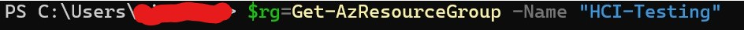
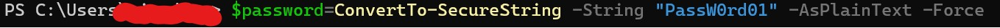
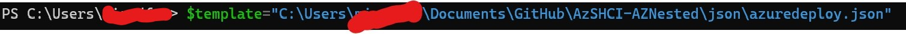
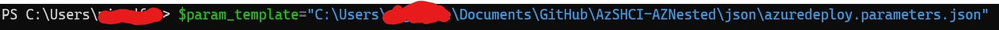

**Welcome to the easiest deployment of Azure Stack HCI, full stack of your life!** With this ARM Template you will be able to deploy a working, nested Azure Stack HCI cluster with Hyper-V, Storage Spaces Direct and Software Defined Networking, all manged by Windows Admin Center. It's so simple!

There are two main methods of deployment, GUI using the "Deploy to Azure" button here, or PowerShell. 

Both methods will require you have a few things:

-An Azure Subscription with Permissions to create a Resource Group and at least Contributor Permissions on that Resource Group

-the AZ Powershell Module, simply run Install-Module -Name AZ in your Powershell session. (PowerShell only method)

-Copy of the code, located in this repository.

**Deploy to Azure Method**

You will NEED to supply your own Parameters file, which is located in this repository. You can simply load the file from the JSON folder, or copy/paste. Your choice.

First step, you will want to click "Edit Parameters"

Then you will want to load the Parameters File, remember the file is located in the JSON folder in the Repository.

You will need to supply the Resource Group and the Admin Password still, but this is a fairly easy process.

Hit Review+Create and jump to the "After Deployment Section"

**PowerShell Process**

If you are more familiar with PowerShell and would rather do the deployment in Command Line, well Awesome, that is how you should be doing this. The instructions are below:

First, you will need to login to your Azure Account in your Terminal Session.

Then you will need to select your Subscription

Following that, you will want to create a Resource Group Name Variable, something like:

then you need a password, stored as a variable, don't forget it, you will need it to login to the VM we create.

Now store the template files as variables. Try something like

and

Phew, we are ready to deploy. Ready, here we go.

Give this a couple of minutes, and you will see your new VM, ASHCIHost001 if you kept the default name, in your Resource group. You can RDP to the Public IP address and then begin the deployment of the cluster, this first step was only to deploy the Host, the real fun begins next but don't worry it really is easy.

So, the deployment may error out, with a warning about the DSC extension not completing due to a system shutdown. Don't worry though. That's the beauty of DSC, the configuration will run every 15 minutes. 

Go grab a coffee or lunch, the components need a few minutes to download, but once you see the shortcut on the desktop, named New-AZSHCI-Sandbox, you are ready to go. 

Ok, are you ready to deploy this cluster, fair enough. This is challenging, so pay attention. I want you to right click the shortcut on the desktop, and select "Run with PowerShell." Ok, go watch a movie, the next episode of Wanda-Vision/ Mandalorian. We need like 2 hours, and you should come back to 3 Virtual Machines, deployed on this host. That's it, really. You now have a working Azure Stack HCI cluster, it has Hyper-V configured, a Fail over Cluster, Storage Spaces Direct, Software Defined Networking and to manage it all, Windows Admin Center. Have fun, and read how to use this lab below:

**After Azure Deployment**

**# Azure Stack HCI Sandbox (2/7/2021)**

The Azure Stack HCI Sandbox is a series of scripts that creates a [HyperConverged](https://docs.microsoft.com/en-us/windows-server/hyperconverged/) environment using four nested Hyper-V Virtual Machines. The purpose of the SDN Sandbox is to provide operational training on Microsoft SDN as well as provide a development environment for DevOPs to assist in the creation and
validation of SDN features without the time consuming process of setting up physical servers and network routers\switches.

>**SDN Sandbox is not a production solution!** SDN Sandbox's scripts have been modified to work in a limited resource environment. Because of this, it is not fault tolerant, is not designed to be highly available, and lacks the nimble speed of a **real** Microsoft SDN deployment.

Also, be aware that SDN Sandbox is **NOT** designed to be managed by System Center Virtual Machine Manager (SCVMM), but by Windows Admin Center. Let me know if you need a version that uses SCVMM. If there are enough requests, I will create a version for that.

## History

SDN Sandbox is a *really* fast refactoring of scripts that I wrote for myself to rapidly create online labs for SDN using SCVMM. The SCVMM scripts have been stripped out and replaced with a stream-lined version that uses Windows Admin Center for the management of Microsoft SDN.

## Scenarios

The ``SCRIPTS\Scenarios`` folder in this solution will be updated quite frequently with full solutions\examples of popular SDN scenarios. Please keep checking for updates!

## Quick Start (TLDR)

You probably are not going to read the requirements listed below, so here are the steps to get SDN Sandbox up and running on a **single host** :

1. Download and unzip this solution to a drive on a Intel based System with at least 64gb of RAM, 2016 (or higher) Hyper-V Installed, and , optionally, a External Switch attached to a network that can route to the Internet and provides DHCP (Getting Proxy to work is on my list).

> **Note** - It is best to use Windows Server **Desktop Experience** on a single machine as it is easier to RDP into the **Console** VM.

2. Create Sysprepped VHDX files for the 2019 Datacenter GUI.

3. Create a Sysprepped Azure Stack HCI VHDX file (with the latest updates).

4. Edit the .PSD1 configuration file (do not rename it) to set:
    
    * The Password needs to be the same as the local administrator password on your physical Hyper-V Host

    * Product Key for Server 2019 
      
    >**Warning!** The Configuration file will be copied to the console drive during install. **The product keys will be in plain text and not deleted or hidden!**     
    
    * The paths to the VHDX files that you just created.
    * Set ``HostVMPath`` where your VHDX files will reside. (*Ensure that there is at least 250gb of free space!*)
    * Optionally, set the name of your external switch that has access to the internet in the ``natExternalVMSwitchName = `` setting and optionally the VLAN for it in the ``natVLANID``. If you don't want Internet access, set ``natConfigure`` to ``$false``.

5. Download the [**Windows Admin Center**](https://docs.microsoft.com/en-us/windows-server/manage/windows-admin-center/understand/windows-admin-center) install file and place it in the `.\Windows Admin Center` folder.

6. On the Hyper-V Host, open up a PowerShell console (with admin rights) and navigate to the ``AzSHCISandbox` folder and run ``.\New-AzSHCISandbox``.

7. It should take a little over an hour to deploy (if using SSD drives).

8. Using RDP, log into the 'Admincenter' virtual machine with your creds: User: Contoso\Administrator Password: Password01

9. Launch the link to Windows Admin Center

10. Add the Hyper-Converged Cluster *AzStackCluster* to *Windows Admin Center* with *Network Controller*: [https://nc01.contosoc.com](https://nc01.contosoc.com) and you're off and ready to go!

## Configuration Overview

AzSHCISandbox will automatically create and configure the following:

* Active Directory virtual machine
* Windows Admin Center virtual machine
* Routing and Remote Access virtual machine (to emulate a *Top of Rack (ToR)* switch)
* Two node Hyper-V S2D cluster with each having a SET Switch
* One Single Node Network Controller virtual machine
* One Software Load Balancer virtual machine
* Two Gateway virtual machines (one active, one passive)
* Management and Provider VLAN and networks 
* Private, Public, and GRE VIPs and automatically configured in Network Controller
* VLAN to provide testing for L3 Gateway Connections

## Hardware Prerequisites

The AzSHCISandbox can only run on a single host.

|  Number of Hyper-V Hosts | Memory per Host   | HD Available Free Space   | Processor   |  Hyper-V Switch Type |
|---|---|---|---|---|
| 1  | 64gb | 250gb SSD\NVME   | Intel - 4 core Hyper-V Capable with SLAT   | Installed Automatically by Script  |

Please note the following regarding the hardware setup requirements:

* If using more than one host, ensure that all hosts have an **EXTERNAL** Hyper-V Switch that has the same name across all the Hyper-V Servers used in the lab.
* Windows Server 2016 (Standard or Datacenter) or higher Hyper-V **MUST** already have been installed along with the RSAT-Hyper-V tools.

* It is recommended that you disable all disconnected network adapters or network adapters that will not be used.

* It is **STRONGLY** recommended that you use SSD or NVME drives (especially in single-host). This project has been tested on a single host with four 5400rpm drives in a Storage Spaces pool with acceptable results, but there are no guarantees.

* If using more than one host, an unmanaged switch or dumb hub should be used to link all of the systems together. If a managed switch is used, ensure that the following VLANS are created and trunked to the ports the host(s) will be using:

   * VLAN 12 – **Provider Network**
   * VLAN 200 - **VLAN for L3 testing** (optional)

> **Note:** The VLANs being used can be changed using the configuration file.

>**Note:** If the default Large MTU (Jumbo Frames) value of 9014 is not supported in the switch or NICs in the environment, you may need to set the SDNLABMTU value to 1514 in the SDN-Configuration file.

### NAT Prerequisites

Internet access is required.
On the Hyper-V Host, create a VMswitch  that maps to a NIC attached to a network that has internet access and provides addresses using DHCP. The configuration file will need to be updated to include the name of this VMswitch to use for NAT.

## Software Prerequisites

### Required VHDX files:

 **GUI.vhdx** - Sysprepped Desktop Experience version of Windows Server 2019 **Datacenter**. Only Windows Server 2019 Datacenter is supported. Other releases such as Server Datacenter 1809 are not supported as they do not support S2D.           
  
**AzSHCI.vhdx** - Same requirements.

>**Note:** Product Keys WILL be required to be entered into the Configuration File. If you are using VL media, use the [KMS Client Keys](https://docs.microsoft.com/en-us/windows-server/get-started/kmsclientkeys) keys for the version of Windows you are installing.

## Required Software

[**Windows Admin Center**](https://docs.microsoft.com/en-us/windows-server/manage/windows-admin-center/understand/windows-admin-center) - The latest version of Windows Admin Center's MSI installer file should be at the root of the *Windows Admin Center* folder under *.\Applications*

## Configuration File (NestedSDN-Config) Reference

The following are a list of settings that are configurable and have been fully tested. You may be able to change some of the other settings and have them work, but they have not been fully tested.

>**Note:** Changing the IP Addresses for Management Network (*default of 192.168.1.0/24*) has been succesfully tested.

| Setting                  |Type| Description                                                                                                                         |  Example                           |
|--------------------------------------|--------|-----------------------------------------------------------------------------------------------------------------------------------------------------------------------------------------------------------------|-----------------------------|
| ConfigureBGPpeering                  | bool   | Peers the GW and MUX VMs with the BGP-ToR-Router automatically if ProvisionNC = $true  
| consoleVHDXPath                      | string | This value controls the location of the Windows 10 Console VHDX                                                                                                                                                 | C:\2019 VHDS\Console.vhdx   |
| COREProductKey                       | string | Product key for Datacenter Core. Usually the same key as GUI.                                                                                                                                                   |                             |
| coreVHDXPath                         | string | This value controls the location of the Core VHDX.                                                                                                                                                              | C:\2019 VHDS\2019_CORE.vhdx |
| DCName                               | string | Name of the domain controller. Must be limited to 14 characters.                                                                                                                                                | fabrikam.dc                 |
| GUIProductKey                        | string | Product key for GUI. Usually the same key as Core.                                                                                                                                                              |                             |
| guiVHDXPath                          | string | This value controls the location of the GUI VHDX.                                                                                                                                                               | C:\2019 VHDS\2019_GUI.vhdx  |
| HostVMPath                           | string | This value controls the path where the Nested VMs will be stored on all hosts                                                                                                                                   | V:\VMs                      |
| InternalSwitch                       | string | Name of internal switch that the SDN Lab VMs will use in Single Host mode. This only applies when using a single host. If the internal switch does not exist, it will be created.                               | Fabrikam                    |
| MultipleHyperVHostExternalSwitchName | string | Name of the External Hyper-V VM Switch identical on all hosts making Multiple Hyper-V Hosts                                                                                                                     | "MyExternalSwitch"          |
| MultipleHyperVHostNames              | array  | Array of all of the hosts which make up the Nested VM environment. Only 2 or 4 hosts supported                                                                                                                  | @("XEON8","XEON9")          |
| MultipleHyperVHosts                  | bool   | Set to $true if deploying the Nested VM environment across multiple hosts. Set to $false if deploying to a single host.                                                                                         |                             |
| natConfigure                         | bool   | Specifies whether or not to configure NAT                                                                                                                                                                       |                             |
| natDNS                               | string | DNS address for forwarding from Domain Controller. Currently set to Cloudflare's 1.1.1.1 by default.                                                                                                            | 1.1.1.1                     |
| natExternalVMSwitchName              | string | Name of external virtual switch on the physical host that has access to the Internet.                                                                                                                           | Internet                    |
| natSubnet                            | string | This value is the subnet is the NAT router will use to route to  SDNMGMT to access the Internet. It can be any /24 subnet and is only used for routing. Keep the default unless it overlaps with a real subnet. | 192.168.46.0/24             |
| natVLANID                            | int    | VLAN ID (if needed) that for access to the external network that requires Internet access. (Note: The network will require DHCP).                                                                               |                             |
| NestedVMMemoryinGB                   | int    | This value controls the amount of RAM for each Nested Hyper-V Host (SDNHOST1-3).                                                                                                                                | 13GB                        |
| ProvisionNC                          | bool   | Provisions Network Controller Automatically.                                                                                                                                                                    |                             |
| SDNAdminPassword                     | string | Password for all local and domain accounts.                                                                                                                                                                     | Password01                  |
| SDNDomainFQDN                        | string | Limit name (before the.xxx) to 14 characters as the name will be used as the NetBIOS name.                                                                                                                      | fabrikam.com                |
| SDNLABMTU                            | int    | Controls the MTU for all Hosts. If using multiple physical hosts. Ensure that you have configured MTU on physical nics on the hosts to match this value.                                                        |                             |
| SDNMGMTMemoryinGB                    | int    | This value controls the amount of RAM for the SDNMGMT Nested VM which contains only the Console, Router, Admincenter, and DC VMs.                                                                               | 13GB                        |
| Setting                              | Type   | Description                                                                                                                                                                                                     | Example                     |
